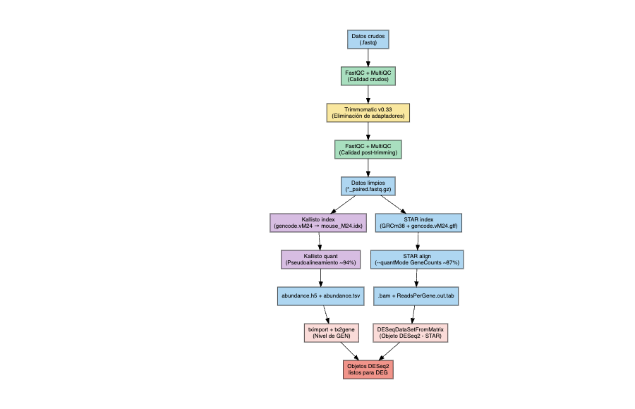

# Análisis de Expresión Diferencial en Hígado de Ratón: Wild-type vs Dp16 (Modelo de Síndrome de Down)

**Materia:** Bioinformática y Estadística II  
**Semestre:** Mayo 2026  
**Equipo:** 4

---

## Integrantes

| Nombre | Usuario | Correo |
|--------|---------|--------|
| Rubí Martínez Chavarría | rmartinez | rubimarch201@gmail.com |
| Leonardo Ivan Anaya González | lanaya | leoianayaglz@gmail.com |

---

## Resumen

Se realizó un análisis de RNA-seq de tejido hepático de ratón adulto comparando la condición wild-type (WT) contra el modelo Dp(16)1Yey (Dp16) de Síndrome de Down. Los datos provienen del bioproyecto PRJNA1259260 (GEO: GSE296420), generados con Illumina NovaSeq 6000 en modalidad paired-end (150 bp, selección polyA, ~25–35 M lecturas por muestra). Se seleccionaron 6 muestras (3 WT y 3 Dp16) con base en profundidad de secuenciación y porcentaje de duplicación. El pipeline incluyó control de calidad con FastQC y MultiQC, limpieza de adaptadores con Trimmomatic, pseudoalineamiento con Kallisto, alineamiento con STAR y análisis de expresión diferencial con DESeq2 seguido de enriquecimiento funcional con gprofiler2. Se identificaron 400 genes diferencialmente expresados con Kallisto y 363 con STAR (padj < 0.05), con activación masiva de metabolismo lipídico y represión de respuesta inmune/complemento en el hígado Dp16, consistentes con los hallazgos de Dunn et al. (2026).

---

## Reporte renderizado

🔗 **[Ver reporte completo (Entregable 4 — DEG + GO)](https://rubi2120.github.io/RNAseq_Equipo4/scripts/Entregable4_final.html)**  
🔗 **[Ver reporte Entregable 3 — FastQC, Trimmomatic, STAR, Kallisto](https://rubi2120.github.io/RNAseq_Equipo4/Entregable3_final.html)**

---

## Descripción de los datos

| Campo | Información |
|-------|------------|
| Bioproject | PRJNA1259260 |
| GEO Accession | GSE296420 |
| Especie | *Mus musculus* |
| Tipo de bibliotecas | Paired-end (PolyA RNA-seq) |
| Método de selección | PolyA (mRNA) |
| Número de transcriptomas | 12 (6 WT, 6 Dp16) |
| Réplicas biológicas | 6 por condición |
| Secuenciador | Illumina NovaSeq 6000 |
| Profundidad | ~25–35 M lecturas por muestra |
| Tamaño de lecturas | 150 bp |
| Tejido | Hígado de ratón adulto (19–26 semanas) |
| Artículo de referencia | Dunn et al., 2026. *Cell Reports*. DOI: 10.1016/j.celrep.2025.116835 |

**Muestras seleccionadas para el análisis:**

| SRR | Condición | Réplica |
|-----|-----------|---------|
| SRR33445253 | Control (WT) | WT_1 |
| SRR33445254 | Control (WT) | WT_2 |
| SRR33445257 | Control (WT) | WT_3 |
| SRR33445260 | Tratamiento (Dp16) | Dp16_1 |
| SRR33445261 | Tratamiento (Dp16) | Dp16_2 |
| SRR33445262 | Tratamiento (Dp16) | Dp16_3 |

---

## Estructura del repositorio

```
RNAseq_Equipo4/
├── DEG_results/
│   ├── DESeq2_STAR_results.csv       # DEGs pipeline STAR + DESeq2
│   └── DESeq2_kallisto_results.csv   # DEGs pipeline Kallisto + DESeq2
├── figures/
│   ├── PCA_rlog_STAR.png
│   ├── PCA_rlog_kallisto.png
│   ├── VolcanoPlot_STAR.png
│   ├── VolcanoPlot.png
│   ├── Heatmap_STAR.pdf
│   ├── Heatmap.pdf
│   ├── fastqc_per_base_sequence_quality_plot.png
│   ├── fastqc_per_base_sequence_quality_plot_trimmed.png
│   ├── fastqc_per_sequence_gc_content_plot.png
│   ├── fastqc_sequence_counts_plot.png
│   ├── fastqc_sequence_duplication_levels_plot.png
│   └── pipeline_rnaseq.png           # Diagrama de flujo del pipeline
├── quality1/
│   └── multiqc_crudos_real.html      # MultiQC datos crudos (pre-Trimmomatic)
├── quality2/
│   ├── multiqc_trimmed.html
│   └── multiqc_trimmed_final.html    # MultiQC post-Trimmomatic
├── results_final/
│   ├── STAR/                         # Cuentas por muestra (ReadsPerGene.out.tab)
│   │   ├── SRR33445252/
│   │   ├── SRR33445253/
│   │   ├── SRR33445254/
│   │   ├── SRR33445260/
│   │   ├── SRR33445261/
│   │   └── SRR33445262/
│   ├── kallisto/                     # Pseudocuentas por muestra (abundance.tsv, abundance.h5)
│   │   ├── SRR33445252/
│   │   ├── SRR33445253/
│   │   ├── SRR33445254/
│   │   ├── SRR33445260/
│   │   ├── SRR33445261/
│   │   └── SRR33445262/
│   ├── DESeq2_STAR_results.csv
│   ├── DESeq2_kallisto_results.csv
│   ├── GSEA_GO_results.csv           # Resultados de enriquecimiento GO
│   └── tx2gene_kallisto.csv          # Tabla transcrito → gen para tximport
├── scripts/
│   ├── out_logs/                     # SLURM outlogs de todos los pasos
│   │   ├── STAR_align_*.err/out
│   │   ├── kallisto_*.err/out
│   │   ├── trimmomatic_*.err/out
│   │   ├── download.err/out
│   │   └── ...
│   ├── 01_download_adapters.sh       # Descarga de datos de SRA
│   ├── 02_trimmomatic.sh             # Limpieza de adaptadores
│   ├── 03_kallisto.sh                # Pseudoalineamiento Kallisto
│   ├── 04_STAR_index.sh              # Construcción del índice STAR
│   ├── 05_STAR_align.sh              # Alineamiento con STAR
│   ├── fastqc_array.sh               # FastQC en array SLURM
│   ├── trimmomatic_final.sh          # Script final Trimmomatic
│   ├── Entregable3_corregido_final.Rmd
│   ├── Entregable3_corregido_final.html
│   ├── Entregable4_final.Rmd         # Reporte principal: DEG + GO
│   └── Entregable4_final.html        # Reporte renderizado
├── Entregable3_final.html            # Reporte Entregable 3 (en raíz para GitHub Pages)
├── metadata.csv                      # Metadatos de las 6 muestras
└── README.md
```

> **Nota:** Los datos crudos (`.fastq.gz`), el índice STAR y el genoma de referencia no están en el repositorio por su tamaño. Se encuentran en el cluster `ken.lavis.unam.mx` en la ruta `/mnt/data/bioinfo-estadistica-2/RNAseq_2026/equipos/Equipo4/`.

---

## Diagrama de flujo del pipeline



---

## Pipeline y scripts

### Paso 1 — Control de calidad de datos crudos

| | |
|---|---|
| **Programa** | FastQC v0.11.x + MultiQC |
| **Script** | `scripts/fastqc_array.sh` |
| **Input** | `data/raw/*.fastq.gz` (en cluster) |
| **Output** | `quality1/multiqc_crudos_real.html` |
| **Outlogs** | `scripts/out_logs/download.out`, `download.err` |

Se evaluó calidad Phred (>30 en todas las posiciones), contenido GC (~50%), nivel de duplicación y presencia de adaptadores TruSeq3 en las 6 muestras seleccionadas.

### Paso 2 — Limpieza de adaptadores

| | |
|---|---|
| **Programa** | Trimmomatic v0.39 |
| **Script** | `scripts/trimmomatic_final.sh` |
| **Input** | `data/raw/*.fastq.gz` |
| **Output** | `data/processed/*_paired.fastq.gz` (en cluster) |
| **Outlogs** | `scripts/out_logs/trimm_final_1611.err`, `trimm_final_1611.out` |

Parámetros: `ILLUMINACLIP:TruSeq3-PE.fa:2:30:10 LEADING:3 TRAILING:3 SLIDINGWINDOW:4:15 MINLEN:36`

### Paso 3 — Control de calidad post-trimming

| | |
|---|---|
| **Programa** | FastQC + MultiQC |
| **Output** | `quality2/multiqc_trimmed_final.html` |

### Paso 4 — Pseudoalineamiento y cuantificación

| | |
|---|---|
| **Programa** | Kallisto v0.48 |
| **Script** | `scripts/03_kallisto.sh` |
| **Input** | `data/processed/*_paired.fastq.gz`, índice Kallisto |
| **Output** | `results_final/kallisto/SRR*/abundance.tsv` y `abundance.h5` |
| **Outlogs** | `scripts/out_logs/kallisto_1511_*.err/out` |

### Paso 5 — Alineamiento

| | |
|---|---|
| **Programa** | STAR v2.7.x |
| **Scripts** | `scripts/04_STAR_index.sh`, `scripts/05_STAR_align.sh` |
| **Input** | `data/processed/*_paired.fastq.gz`, genoma GRCm39 + GTF |
| **Output** | `results_final/STAR/SRR*/*.ReadsPerGene.out.tab` |
| **Outlogs** | `scripts/out_logs/STAR_align_1520_*.err/out`, `STAR_index.err/out` |

### Paso 6 — Expresión diferencial

| | |
|---|---|
| **Programa** | DESeq2 (R 4.x) + tximport + apeglm |
| **Script** | `scripts/Entregable4_final.Rmd` |
| **Input** | `results_final/STAR/` y `results_final/kallisto/` |
| **Output** | `DEG_results/DESeq2_STAR_results.csv`, `DEG_results/DESeq2_kallisto_results.csv` |

Pasos: normalización VST, PCA, análisis DESeq2 con shrinkage apeglm (diseño `~ genotype`, referencia WT), volcano plot, heatmap, diagrama de Venn Kallisto vs STAR.

### Paso 7 — Análisis funcional (GO)

| | |
|---|---|
| **Programa** | gprofiler2 (R) |
| **Output** | `results_final/GSEA_GO_results.csv` |

Enriquecimiento de genes up- y down-regulated en términos GO:BP, GO:CC, KEGG y Reactome.

---

## Archivos de resultados principales

| Archivo | Descripción |
|---------|-------------|
| `DEG_results/DESeq2_STAR_results.csv` | Todos los genes analizados con STAR + DESeq2 (log2FC, padj) |
| `DEG_results/DESeq2_kallisto_results.csv` | Todos los genes analizados con Kallisto + DESeq2 |
| `results_final/GSEA_GO_results.csv` | Términos GO enriquecidos (gprofiler2) |
| `figures/PCA_rlog_STAR.png` | PCA con normalización rlog — STAR |
| `figures/PCA_rlog_kallisto.png` | PCA con normalización rlog — Kallisto |
| `figures/VolcanoPlot_STAR.png` | Volcano plot — STAR |
| `figures/VolcanoPlot.png` | Volcano plot — Kallisto |
| `figures/Heatmap_STAR.pdf` | Heatmap top 20 DEGs — STAR |
| `figures/Heatmap.pdf` | Heatmap top 20 DEGs — Kallisto |
| `quality1/multiqc_crudos_real.html` | Reporte MultiQC datos crudos |
| `quality2/multiqc_trimmed_final.html` | Reporte MultiQC post-Trimmomatic |

---

## Resultados principales

- **Genes diferencialmente expresados:** 400 (Kallisto) y 363 (STAR) con padj < 0.05
- **Genes compartidos entre pipelines:** 264 (~66% de Kallisto, ~73% de STAR)
- **Up-regulated en Dp16:** enriquecimiento masivo en metabolismo de lípidos, ácidos grasos y ácidos biliares (FDR hasta 1.54e-23)
- **Down-regulated en Dp16:** represión de cascada del complemento e inmunidad humoral (FDR hasta 5.80e-11)
- Resultados consistentes con Dunn et al. (2026): disfunción metabólica hepática como fenotipo dominante en el modelo Dp16

---

## Referencias

1. Dunn, A. et al., 2026. Altered hepatic metabolism in Down syndrome. *Cell Reports*. DOI: [10.1016/j.celrep.2025.116835](https://doi.org/10.1016/j.celrep.2025.116835)

2. Love, M.I., Huber, W., & Anders, S., 2014. Moderated estimation of fold change and dispersion for RNA-seq data with DESeq2. *Genome Biology*, 15, 550. DOI: [10.1186/s13059-014-0550-8](https://doi.org/10.1186/s13059-014-0550-8)

3. Tian, Y. et al., 2023. Gene dosage imbalance disrupts systemic metabolism in the Dp16 Down syndrome mouse model. *bioRxiv / eLife*. DOI: [10.64898/2026.01.13.699318](https://doi.org/10.64898/2026.01.13.699318)

4. Bray, N.L., Pimentel, H., Melsted, P., & Pachter, L., 2016. Near-optimal probabilistic RNA-seq quantification. *Nature Biotechnology*, 34, 525–527. DOI: [10.1038/nbt.3519](https://doi.org/10.1038/nbt.3519)

---

*Análisis realizado en el cluster `ken.lavis.unam.mx`*  
*Ruta del proyecto en el cluster: `/mnt/data/bioinfo-estadistica-2/RNAseq_2026/equipos/Equipo4/`*
