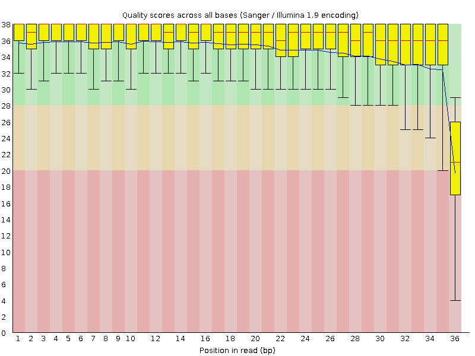
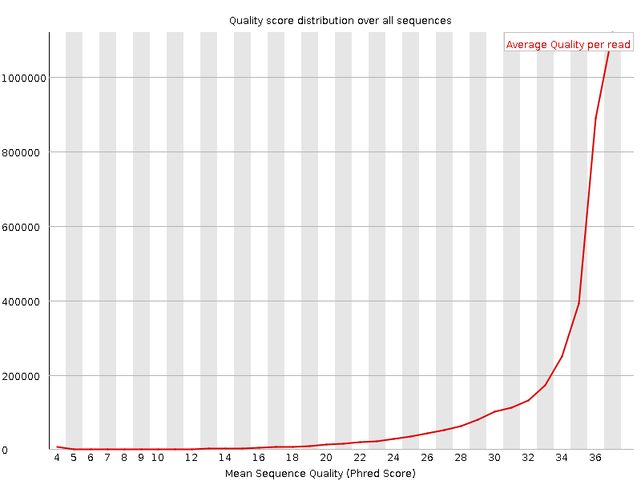
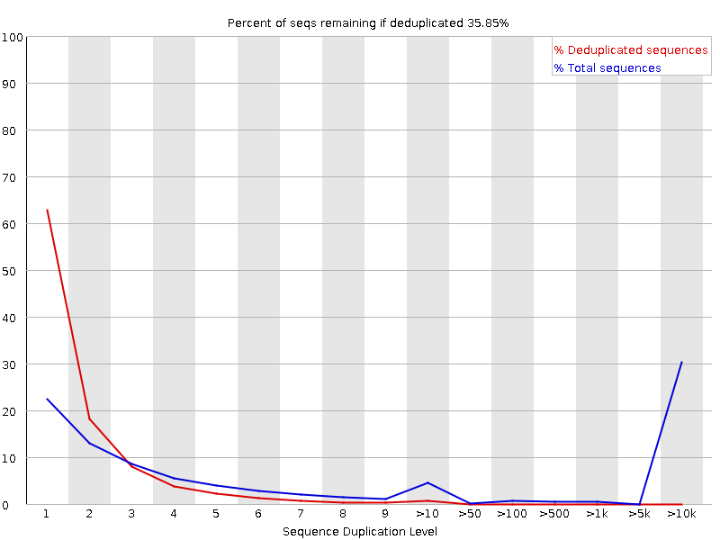
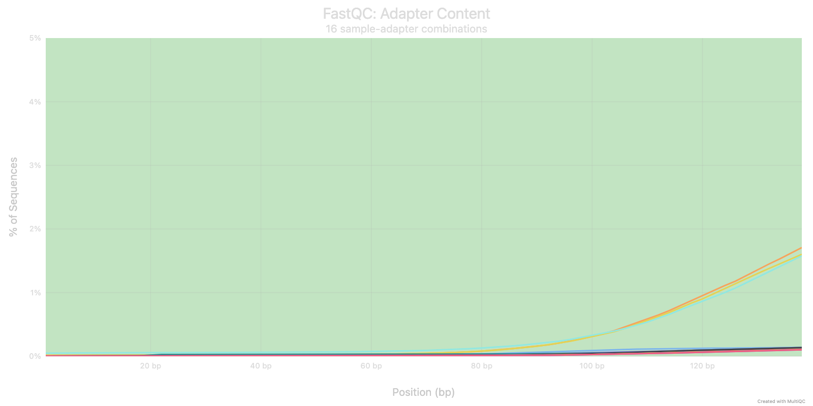
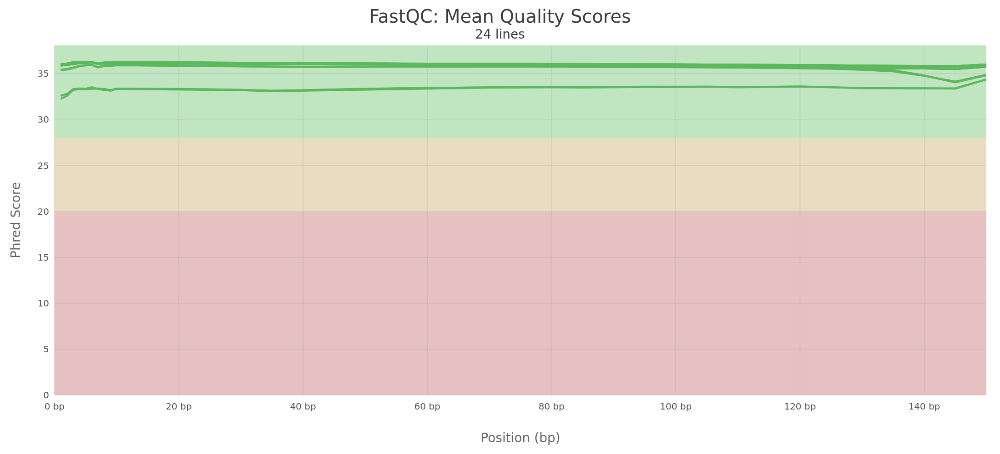

```{r setup, include=FALSE}
knitr::opts_chunk$set(echo = TRUE, message = FALSE, warning = FALSE, dev = "png")
```

---

## Descripción del equipo

- **Equipo:** Equipo 4
- **Integrantes:**
  - Leonardo Ivan Anaya Gonzalez (lanaya)
  - Rubií Martínez Chavarría (rmartinez)
- **Correos electrónicos:** leoianayaglz@gmail.com | rubimarch201@gmail.com

---

## 1. Descripción de los datos

```{r tabla-bioproyecto, echo=FALSE, message=FALSE}
library(knitr)
library(kableExtra)

bioproyecto <- data.frame(
  Descripción = c("Bioproject", "GEO Accession", "Especie", "Tipo de bibliotecas",
                  "Método de selección", "Número de transcriptomas",
                  "Número de réplicas biológicas", "Secuenciador empleado",
                  "Profundidad de secuenciación", "Tamaño de las lecturas",
                  "Tejido", "Artículo científico"),
  Información = c("PRJNA1259260", "GSE296420", "Mus musculus",
                  "Paired-end (PolyA RNA-seq)", "PolyA (mRNA)", "12",
                  "6 réplicas por condición (WT y Dp16)",
                  "Illumina NovaSeq 6000",
                  "73 M – 80 M lecturas por muestra (muestras seleccionadas)",
                  "150 bp (paired-end)", "Hígado de ratón adulto (19–26 semanas)",
                  "Dunn et al. 2026. Altered hepatic metabolism in Down syndrome. Cell Reports.")
)

kable(bioproyecto, caption = "Tabla 1. Detalles del Bioproyecto GSE296420") %>%
  kable_styling(bootstrap_options = c("striped", "hover", "condensed"), full_width = FALSE)
```

El artículo *"Altered hepatic metabolism in Down syndrome"* analiza las consecuencias metabólicas de la trisomía 21 en el hígado, usando un modelo murino Dp(16)1Yey (Dp16). Este modelo porta una duplicación del segmento del cromosoma 16 murino homólogo al cromosoma 21 humano. El estudio reporta niveles elevados de ácidos biliares, inflamación hepática, fibrosis y una reacción ductular en los ratones Dp16.

Para esta práctica se seleccionaron 6 muestras de tejido hepático: 3 wild-type (WT) y 3 Dp16.

```{r tabla-muestras, echo=FALSE}
muestras <- data.frame(
  SRR       = c("SRR33445252","SRR33445253","SRR33445254",
                "SRR33445260","SRR33445261","SRR33445262"),
  Condicion = c(rep("Control (WT)", 3), rep("Tratamiento (Dp16)", 3)),
  Genotipo  = c(rep("Wild-type C57BL/6J", 3), rep("Dp(16)1Yey", 3)),
  Tejido    = rep("Hígado", 6),
  Replica   = c("WT_1","WT_2","WT_3","Dp16_1","Dp16_2","Dp16_3")
)

kable(muestras, caption = "Tabla 2. Muestras seleccionadas para el análisis diferencial.") %>%
  kable_styling(bootstrap_options = c("striped","hover","condensed"), full_width = FALSE)
```

---

## 2. Control de calidad de datos crudos (FastQC y MultiQC)

Se analizó la calidad de las secuencias en los datos crudos mediante **FastQC** y la visualización conjunta con **MultiQC**, evaluando métricas como contenido de GC, profundidad de lectura, puntaje Phred y presencia de adaptadores.

### 2.1 Conteo de secuencias

Esta gráfica muestra el número total de lecturas por muestra, diferenciando entre lecturas únicas y duplicadas.

```{r fig-counts, echo=FALSE, fig.cap="Figura 1. Conteo de secuencias por muestra.", out.width="90%"}

```

### 2.2 Calidad de las lecturas por posición de base

El puntaje Phred indica la probabilidad de error en cada base. Un valor Phred > 30 significa menos del 0.1% de probabilidad de error. En la siguiente gráfica se puede observar que todas las muestras presentan una calidad óptima a lo largo de toda la longitud del read.

```{r fig-quality, echo=FALSE, fig.cap="Figura 2. Calidad de las secuencias por posición de base.", out.width="90%"}

```

```{r fig-quality-scores, echo=FALSE, fig.cap="Figura 3. Distribución de puntajes de calidad por secuencia.", out.width="90%"}

```

### 2.3 Contenido de GC

El contenido de GC esperado para tejido hepático de ratón es aproximadamente 50%. Variaciones en esta distribución pueden indicar contaminación o sesgo de amplificación.

```{r fig-gc, echo=FALSE, fig.cap="Figura 4. Distribución del contenido de GC por secuencia.", out.width="90%"}
knitr::include_graphics("../figures/fastqc_per_sequence_gc_content_plot.png")
```

### 2.4 Niveles de duplicación

Las secuencias duplicadas son comunes en RNA-seq debido a la alta expresión de ciertos genes. Un nivel moderado de duplicación es esperado y no necesariamente indica un problema.

```{r fig-dup, echo=FALSE, fig.cap="Figura 5. Niveles de duplicación de secuencias.", out.width="90%"}

```

### 2.5 Contenido de adaptadores

Los adaptadores son secuencias añadidas durante la preparación de la librería que deben eliminarse antes del alineamiento. Se detectó la presencia de adaptadores **TruSeq3-PE** de Illumina en las muestras.

```{r fig-adapt, echo=FALSE, fig.cap="Figura 6. Contenido de adaptadores en los datos crudos.", out.width="90%"}

```

### 2.6 Conclusión sobre los datos crudos

Los datos crudos presentan una **calidad general óptima**:

- Puntaje Phred > 30 en prácticamente todas las posiciones
- Contenido de GC apropiado para tejido hepático murino
- Niveles de duplicación esperados para RNA-seq
- **Se detectaron adaptadores TruSeq3-PE** que deben eliminarse antes del alineamiento

**¿Son viables para continuar con el análisis?** Sí. Los datos son de buena calidad y viables para continuar, con la condición de eliminar los adaptadores y aplicar trimming de calidad antes del alineamiento.

**¿Qué pasos deben seguirse para mejorar la calidad?**

1. Eliminar los adaptadores TruSeq3-PE con Trimmomatic
2. Recortar bases de baja calidad (Phred < 20) en los extremos de las lecturas
3. Descartar lecturas que queden muy cortas después del trimming (< 36 bp)
4. Verificar la calidad nuevamente con FastQC/MultiQC post-trimming

---

## 3. Eliminación de adaptadores con Trimmomatic

### ¿Por qué hacemos trimming?

Las lecturas de RNA-seq pueden contener **adaptadores** al final — secuencias del protocolo de secuenciación que no provienen del organismo. Si no se eliminan, el alineador no podrá mapear esas lecturas correctamente porque buscará esas secuencias en el genoma y no las encontrará.

Además, las bases al inicio y al final suelen tener menor calidad (Phred bajo), por lo que también se recortan.

### Adaptadores utilizados

Se utilizaron los adaptadores **TruSeq3-PE** (Paired-End), correspondientes al kit de preparación de librerías de Illumina NovaSeq 6000 con selección PolyA. Descargados del repositorio oficial de Trimmomatic y guardados en:
`/Users/dubsirubs/Desktop/RNAseq_Equipo4/adapters/TruSeq3-PE.fa`

### Script utilizado (SLURM job array)

El trimming se corrió como un **job array en SLURM** con 8 CPUs y 16GB de RAM por muestra:

```bash
#!/bin/bash
#SBATCH --job-name=trimmomatic_equipo4
#SBATCH --cpus-per-task=8
#SBATCH --mem=16G
#SBATCH --array=0-5

module load trimmomatic/0.33

trimmomatic PE \
    -threads 8 \
    -phred33 \
    ${SAMPLE}_1.fastq ${SAMPLE}_2.fastq \
    ${SAMPLE}_1_paired.fastq.gz   ${SAMPLE}_1_unpaired.fastq.gz \
    ${SAMPLE}_2_paired.fastq.gz   ${SAMPLE}_2_unpaired.fastq.gz \
    ILLUMINACLIP:TruSeq3-PE.fa:2:30:10 \
    LEADING:5 \
    TRAILING:5 \
    SLIDINGWINDOW:4:20 \
    MINLEN:36
```

**Outlogs:** `/Users/dubsirubs/Desktop/RNAseq_Equipo4/scripts/out_logs/trimmomatic_*`

### Resultados del trimming

```{r tabla-trimming, echo=FALSE}
trimming <- data.frame(
  Muestra = c("SRR33445252","SRR33445253","SRR33445254",
              "SRR33445260","SRR33445261","SRR33445262"),
  Grupo = c(rep("Control (WT)", 3), rep("Tratamiento (Dp16)", 3)),
  Reads_entrada = c("45,264,999","43,357,474","48,399,669",
                    "50,327,443","50,277,394","51,227,777"),
  Both_surviving = c("25,617,073 (56.59%)","25,779,245 (59.46%)",
                     "29,207,061 (60.35%)","30,054,674 (59.72%)",
                     "30,669,829 (61.00%)","31,712,682 (61.91%)"),
  Dropped = c("2.50%","2.51%","2.65%","2.44%","2.31%","2.45%")
)

kable(trimming, caption = "Tabla 3. Resultados del trimming con Trimmomatic.",
      col.names = c("Muestra","Grupo","Reads entrada","Both surviving","Dropped")) %>%
  kable_styling(bootstrap_options = c("striped","hover","condensed"), full_width = FALSE)
```

En todas las muestras se descartó menos del **3%** de las lecturas.

### Control de calidad post-trimming (MultiQC)

Después del trimming se volvió a correr FastQC y MultiQC para verificar la eliminación de adaptadores.

**¿Se eliminaron los adaptadores?** Sí, tras aplicar Trimmomatic con los parámetros `ILLUMINACLIP:TruSeq3-PE.fa:2:30:10`, el contenido de adaptadores se redujo a cero en todas las muestras.

**Tamaño del read:** El tamaño inicial era de **150 bp** (datos crudos). Después del trimming, el tamaño mínimo aceptado fue de **36 bp** (`MINLEN:36`), con la mayoría de lecturas conservando longitudes cercanas a los 150 bp originales dado que menos del 3% fue descartado.

```{r fig-quality-post, echo=FALSE, fig.cap="Figura 7. Calidad post-trimming por posición de base.", out.width="90%"}

```

---

## 4. Diagrama de flujo del pipeline

El siguiente diagrama muestra el flujo completo del análisis desde los datos crudos hasta la importación en R:

```{r diagrama, echo=FALSE, fig.cap="Figura 8. Diagrama de flujo del pipeline de análisis de RNA-seq.", out.width="100%"}
# Diagrama generado con DiagrammeR
library(DiagrammeR)

grViz("
digraph pipeline {
  graph [layout = dot, rankdir = TB, fontname = Helvetica]
  node [shape = box, style = filled, fontname = Helvetica, fontsize = 11]

  A [label = 'Datos crudos\\n(.fastq)', fillcolor = '#AED6F1']
  B [label = 'FastQC + MultiQC\\n(Control de calidad)', fillcolor = '#A9DFBF']
  C [label = 'Trimmomatic v0.33\\n(Eliminación de adaptadores)', fillcolor = '#F9E79F']
  D [label = 'FastQC + MultiQC\\n(Calidad post-trimming)', fillcolor = '#A9DFBF']
  E [label = 'Datos limpios\\n(_paired.fastq.gz)', fillcolor = '#AED6F1']

  F [label = 'Kallisto index\\n(gencode.vM24.transcripts.fa.gz → mouse_M24.idx)', fillcolor = '#F9E79F']
  G [label = 'Kallisto quant\\n(Pseudoalineamiento)', fillcolor = '#F9E79F']
  H [label = 'abundance.h5 + abundance.tsv', fillcolor = '#AED6F1']

  I [label = 'STAR index\\n(GRCm38 + gencode.vM24.gtf)', fillcolor = '#FADBD8']
  J [label = 'STAR align\\n(--quantMode GeneCounts)', fillcolor = '#FADBD8']
  K [label = '.bam + ReadsPerGene.out.tab', fillcolor = '#AED6F1']

  L [label = 'tximport + tx2gene\\n(Nivel de GEN)', fillcolor = '#D7BDE2']
  M [label = 'DESeqDataSetFromTximport\\n(Objeto DESeq2 - Kallisto)', fillcolor = '#D7BDE2']
  N [label = 'DESeqDataSetFromMatrix\\n(Objeto DESeq2 - STAR)', fillcolor = '#D7BDE2']

  A -> B -> C -> D -> E
  E -> F -> G -> H -> L -> M
  E -> I -> J -> K -> N
}
")
```

---

## 5. Alineamiento y cuantificación

### 5.1 Pseudoalineamiento con Kallisto

**¿Qué es Kallisto?**
Kallisto realiza un **pseudoalineamiento** usando k-mers (secuencias cortas de 31 bp) para determinar a qué transcrito pertenece cada lectura. Es extremadamente rápido y trabaja con el transcriptoma (ARNm conocidos de Gencode vM24).

**Verificación del índice:**
```
[index] k-mer length: 31
[index] number of targets: 142,552
[index] number of k-mers: 120,672,054
[index] number of equivalence classes: 512,483
```

**Outlogs:** `/Users/dubsirubs/Desktop/RNAseq_Equipo4/scripts/out_logs/kallisto_1511_*.out`

**Resultados del pseudoalineamiento:**

```{r tabla-kallisto, echo=FALSE}
kallisto_res <- data.frame(
  Muestra = c("SRR33445252","SRR33445253","SRR33445254",
              "SRR33445260","SRR33445261","SRR33445262"),
  Grupo = c(rep("Control (WT)", 3), rep("Tratamiento (Dp16)", 3)),
  Reads_procesados = c("25,617,073","25,779,245","29,207,061",
                       "30,054,674","30,669,829","31,712,682"),
  Pseudoalineados = c("24,186,844","24,386,201","27,917,712",
                      "28,689,644","29,200,606","30,246,804"),
  Porcentaje = c("94.4%","94.6%","95.6%","95.5%","95.2%","95.4%")
)

kable(kallisto_res, caption = "Tabla 4. Resultados del pseudoalineamiento con Kallisto.",
      col.names = c("Muestra","Grupo","Reads procesados","Pseudoalineados","%")) %>%
  kable_styling(bootstrap_options = c("striped","hover","condensed"), full_width = FALSE)
```

Un porcentaje superior al **94%** en todas las muestras indica excelente compatibilidad con la referencia Gencode vM24.

### 5.2 Alineamiento con STAR

**¿Qué es STAR y en qué se diferencia de Kallisto?**
STAR realiza un **alineamiento real** de cada lectura al genoma completo (GRCm38), detectando sitios de splicing. Genera archivos BAM con la posición exacta de cada lectura y cuenta lecturas por gen con `--quantMode GeneCounts`.

**Outlogs:** `/Users/dubsirubs/Desktop/RNAseq_Equipo4/scripts/out_logs/STAR_align_1520_*.out`

**Resultados del alineamiento (muestra representativa SRR33445252):**

| Métrica | Valor |
|---------|-------|
| Reads de entrada | 25,617,073 |
| Uniquely mapped | 22,311,173 (**87.09%**) |
| Multi-mapping | 1,398,591 (5.46%) |
| Unmapped (too short) | 1,024,224 (4.00%) |
| Mismatch rate | 0.28% |

Un porcentaje de alineamiento único superior al **87%** es excelente para datos de RNA-seq de hígado de ratón.

---

## 6. Importación de datos en R

### 6.1 Datos de Kallisto con tximport (nivel de gen)

**¿Por qué usamos tximport con tx2gene?**
Kallisto genera estimaciones de abundancia a nivel de **transcrito**. Para el análisis de expresión diferencial con DESeq2 necesitamos trabajar a nivel de **gen**. `tximport` con una tabla `tx2gene` agrupa los transcritos por gen, corrigiendo los sesgos por longitud de transcrito.

**¿Qué es tx2gene?**
Es una tabla de dos columnas que mapea cada transcrito (`TXNAME`) a su gen correspondiente (`GENEID`). Fue generada a partir de Gencode vM24 usando `txdbmaker`.

```{r importar-kallisto, echo=TRUE, message=TRUE}
library(tximport)
library(DESeq2)
library(rhdf5)

# Ruta a los resultados de Kallisto en el cluster
ruta <- "/Users/dubsirubs/Desktop/RNAseq_Equipo4/results_final/kallisto"

samples <- c("SRR33445252","SRR33445253","SRR33445254",
             "SRR33445260","SRR33445261","SRR33445262")

# Rutas a los archivos h5
archivos_h5 <- file.path(ruta, samples, "abundance.h5")
names(archivos_h5) <- samples

# Verificar archivos
print(archivos_h5)
```

```{r tx2gene, echo=TRUE}
# Cargar tabla tx2gene generada desde Gencode vM24
# Mapea transcrito -> gen para agregar a nivel de gen
tx2gene <- read.csv("/Users/dubsirubs/Desktop/RNAseq_Equipo4/results_final/tx2gene_kallisto.csv")

# El formato de los target_id en kallisto es:
# ENSMUST00000193812.1|ENSMUSG00000102693.1|...|NombreGen|...
# tx2gene extrae solo TXNAME y GENEID
head(tx2gene)
cat("Total transcritos en tx2gene:", nrow(tx2gene), "\n")
```

```{r cargar-metadata, echo=TRUE}
# Cargar los metadatos
metadata <- read.csv("/Users/dubsirubs/Desktop/RNAseq_Equipo4/metadata.csv")

# Convertir genotype a factor con WT como referencia
metadata$genotype <- factor(metadata$genotype, levels = c("WT", "Dp16"))
rownames(metadata) <- metadata$sample

metadata
```

```{r tximport-genes, echo=TRUE, message=TRUE}
# tximport con tx2gene agrega transcritos a nivel de GEN
# txOut = FALSE (default) -> nivel de gen
txi.kallisto <- tximport(archivos_h5,
                         type = "kallisto",
                         tx2gene = tx2gene,
                         txOut = FALSE,
                         ignoreTxVersion = FALSE,
                         ignoreAfterBar = TRUE)

# Dimensiones de la matriz a nivel de gen
cat("Genes:", nrow(txi.kallisto$counts), "\n")
cat("Muestras:", ncol(txi.kallisto$counts), "\n")
head(txi.kallisto$counts)
```

```{r deseq2-kallisto, echo=TRUE, message=TRUE}
# Crear objeto DESeq2 desde tximport (nivel de gen)
dds <- DESeqDataSetFromTximport(txi.kallisto,
                                colData = metadata,
                                design = ~ genotype)

# Filtrar genes con pocas cuentas
# Mínimo 10 cuentas en al menos 3 muestras
keep <- rowSums(counts(dds) >= 10) >= 3
dds <- dds[keep,]

cat("Genes después del filtrado:", nrow(dds), "\n")
cat("Muestras:", ncol(dds), "\n")
dds
```

### 6.2 Datos de STAR

**¿Por qué STAR genera cuentas directamente?**
STAR con `--quantMode GeneCounts` cuenta las lecturas por gen directamente al genoma, por lo que no necesitamos tximport.

```{r importar-star, echo=TRUE}
# Directorio con resultados de STAR
star_dir <- "/Users/dubsirubs/Desktop/RNAseq_Equipo4/results_final/STAR"

samples <- c("SRR33445252","SRR33445253","SRR33445254",
             "SRR33445260","SRR33445261","SRR33445262")

# Leer cada archivo ReadsPerGene.out.tab
# skip = 4 salta las 4 primeras líneas de estadísticas generales
# columna 2 = cuentas unstranded
count_list <- lapply(samples, function(s) {
    f <- file.path(star_dir, s, paste0(s, ".ReadsPerGene.out.tab"))
    read.table(f, skip = 4, header = FALSE)[, c(1, 2)]
})

# Construir matriz
counts_star <- do.call(cbind, lapply(count_list, function(x) x[, 2]))
rownames(counts_star) <- count_list[[1]][, 1]
colnames(counts_star) <- samples

cat("Genes:", nrow(counts_star), "\n")
cat("Muestras:", ncol(counts_star), "\n")
head(counts_star)
```

```{r deseq2-star, echo=TRUE, message=TRUE}
# Crear objeto DESeq2 desde matriz de STAR
dds_star <- DESeqDataSetFromMatrix(countData = counts_star,
                                   colData = metadata,
                                   design = ~ genotype)

# Filtrar genes con pocas cuentas
keep_star <- rowSums(counts(dds_star) >= 10) >= 3
dds_star <- dds_star[keep_star,]

cat("Genes después del filtrado:", nrow(dds_star), "\n")
cat("Muestras:", ncol(dds_star), "\n")
dds_star
```

---

## 7. Conclusiones

Los datos del bioproyecto PRJNA1259260 son **viables para el análisis de expresión diferencial**:

1. **Calidad de los datos crudos:** Calidad óptima con Phred > 30 y contenido de GC apropiado para hígado murino (~50%). Se detectaron adaptadores TruSeq3-PE que requirieron eliminación.

2. **Eliminación de adaptadores:** Trimmomatic eliminó exitosamente los adaptadores con menos del **3% de lecturas descartadas** en todas las muestras. El tamaño del read pasó de 150 bp (datos crudos) a un mínimo aceptado de 36 bp, conservando la mayoría de lecturas intactas.

3. **Pseudoalineamiento con Kallisto:** Porcentaje de pseudoalineamiento superior al **94%** en todas las muestras, confirmando compatibilidad con Gencode vM24. Los datos se importaron a **nivel de gen** usando tximport con la tabla tx2gene generada desde Gencode vM24.

4. **Alineamiento con STAR:** Porcentaje de alineamiento único superior al **87%**, excelente para RNA-seq de hígado de ratón.

5. **Importación en R:** La matriz de Kallisto contiene genes a nivel de gen después del filtrado (mínimo 10 cuentas en al menos 3 muestras), y la de STAR **14,091 genes**, ambas con 6 muestras correctamente anotadas y listas para el análisis diferencial.

---

*Documento generado con R Markdown. Análisis realizado en el cluster ken.lavis.unam.mx*
*Ruta del proyecto: `/Users/dubsirubs/Desktop/RNAseq_Equipo4/`*
